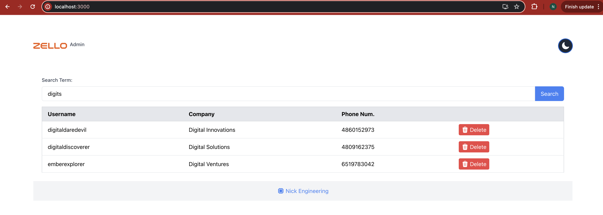

# Zello Admin

Zello Admin is a web application designed to manage users, perform searches, and handle some administrative tasks. This project leverages Go for the backend API and React for the frontend interface.

## Table of Contents

- [Features](#features)
- [Getting Started](#getting-started)
    - [Prerequisites](#prerequisites)
    - [Installation](#installation)
- [Usage](#usage)
- [API Endpoints](#api-endpoints)


## Getting Started

### Prerequisites

- [Docker](https://www.docker.com/get-started)
- [Docker Compose](https://docs.docker.com/compose/install/)

### Installation

1. Clone the repository:

    ```sh
    git clone https://github.com/nickolay-avasiloy/zello-admin.git
    cd zello-admin
    ```

2. Copy the `.env.example` file to `.env` and configure your environment variables:

    ```sh
    cp .env.example .env
    ```

3. Build and start the application using Docker Compose:

    ```sh
    docker-compose up --build
    ```

This command will build the Docker images and start the containers for the backend API and the frontend application.

### Note

In the initial data set, there was an invalid entry `,Digital Solutions,9316275048`, which I have omitted.


## User Database

In addition to simple ILIKE search functionality, I have implemented TSV (text search vector) which allows for more advanced search capabilities. 
TSV vectors takes into account plurals and different word forms, such as if you search "digits" it will find "digit" too or "innovating" will find "innovate", by using `english` dictionary. 
This make search more flexible and user-friendly.

### Here are examples of the TSV vectors representation:

| UUID                                   | Username              | Company                    | Phone Number | TSV                                                      |
|----------------------------------------|-----------------------|----------------------------|--------------|----------------------------------------------------------|
| 7aecff7b-1d33-4f1d-a284-01e33f4dc22e   | digitaldaredevil      | Digital Innovations        | 4860152973   | '4860152973':4C 'digit':2B 'digitaldaredevil':1A 'innov':3B |
| da6a6fb6-ac1e-458d-9a98-cf9462ef2123   | retrorover            | Retro Innovate             | 7584903261   | '7584903261':4C 'innov':3B 'retro':2B 'retrorov':1A       |

For more sophisticated search solution I would recommend using [LLM Vector] with services like Pinecone, which is a vector search engine that allows you to search for similar items based on their embeddings.

## Usage

Once containers are up and running, you can access the application:

- Frontend: [http://localhost:3000](http://localhost:3000)
- Backend API: [http://localhost:8080](http://localhost:8080)

### Testing the Endpoints

You can use tools like `curl`, Postman, or a web browser to interact with the backend API. Below are some example requests:


1. **Get a list of 10 random users:**

    ```sh
    curl -X GET "http://localhost:8080/api/users"
    ```

2. **Search for users:**

    ```sh
    curl -X GET "http://localhost:8080/api/search?q=pixel"
    ```

3. **Delete a user by UUID:**

    ```sh
    curl -X DELETE "http://localhost:8080/api/users/{uuid}"
    ```

## API Endpoints

### GET /api/users

- **Description:** Retrieve a list of 10 random users.
- **Response:** Array of user objects.

### GET /api/search

- **Description:** Search for users based on a query string.
- **Parameters:** `q` - The search query string.
- **Response:** Array of user objects that match the search criteria.

### DELETE /api/users/:uuid

- **Description:** Delete a user by UUID.
- **Response:** `{"message": "User deleted"}` or `{"message": "User not found"}`

## Screenshots

### Light Mode


### Dark Mode


### Additional Screenshots


